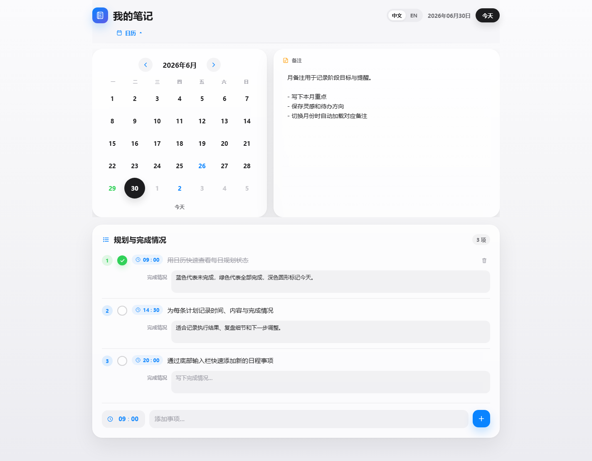
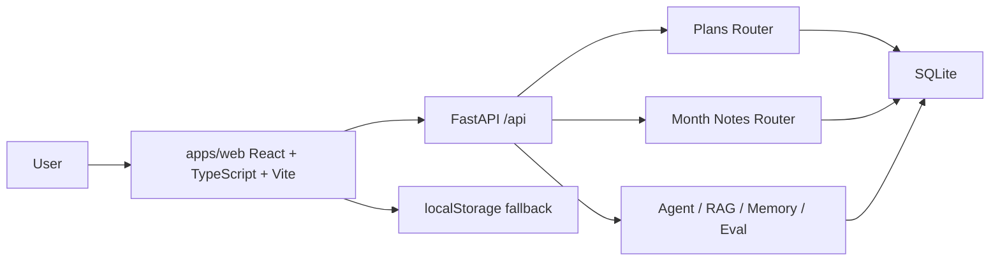

<p align="center">
  <br>
  <strong>MyNotes AI</strong>
  <br>
  <span>AI learning planner, daily review, and personal knowledge assistant.</span>
  <br><br>
  
  
  
  
</p>




## 中文介绍

**MyNotes AI** 是一个面向学习、求职和长期目标管理的 AI 规划系统。它从最初的本地日程工具升级为 React + TypeScript 前端、FastAPI 后端和 SQLite 数据层，目标是做成可以展示给 AI 应用开发 / AI 全栈实习岗位的作品集项目。

当前版本已经支持日历计划、每日任务、完成记录、月备注、AI 目标拆解、动态复盘、资料问答、偏好记忆、Agent 工具定义和规划质量评估。后续阶段会继续接入 DeepSeek、RAG FTS5、Tauri 桌面壳、PyInstaller sidecar 和 GitHub Release 自动构建。

## English

**MyNotes AI** is an AI planning and review system for learning, job search, and long-term goal management. It combines a React + TypeScript frontend, FastAPI backend, and SQLite data layer to demonstrate practical AI application engineering instead of a simple static page.

The project currently includes calendar planning, daily tasks, completion records, monthly notes, AI goal decomposition, review suggestions, material Q&A, preference memory, Agent tool definitions, and planner quality evaluation. The roadmap continues toward DeepSeek integration, SQLite FTS5 RAG, Tauri desktop packaging, PyInstaller sidecar, and GitHub Release builds.

## Current Stage

| Stage | Status | Result |
| --- | --- | --- |
| Phase 0 | Done | Project audit in `docs/audit.md` |
| Phase 1 | Done | Frontend migrated to `apps/web` with React + TypeScript + Vite |
| Phase 2 | Done | FastAPI routers, SQLite schema, plans API, month-notes API, tests |
| Phase 3 | Next | DeepSeek settings and OpenAI-compatible LLM client |

## Features

| Module | What it does |
| --- | --- |
| Calendar planning | Manage daily tasks with time, status, completion notes, and monthly notes |
| SQLite data layer | Store plans and month notes through FastAPI instead of relying only on localStorage |
| AI planning | Generate staged plans and daily tasks from a long-term goal |
| Daily review | Summarize completion records and suggest next actions |
| Material Q&A | Query pasted learning materials or job descriptions with retrieval-style scoring |
| Preference memory | Save personal learning rhythm and planning preferences |
| Agent tools | Expose planning tools such as `create_task`, `search_materials`, and `summarize_week` |
| Evaluation | Score planning quality with simple test cases and criteria |
| Offline fallback | Frontend still works with localStorage when the backend is not running |

## Tech Stack

| Layer | Stack |
| --- | --- |
| Frontend | React 18, TypeScript, Vite, lucide-react |
| Backend | Python, FastAPI, Pydantic |
| Database | SQLite |
| AI workflow | Planner Agent, RAG prototype, Memory, Eval, mock fallback |
| Quality | ESLint, Vitest, Pytest, GitHub Actions |

## Architecture



More details: [docs/architecture.md](docs/architecture.md)

## Run Locally

Start the backend:

```bash
python -m venv .venv
.\.venv\Scripts\activate
pip install -r requirements.txt
uvicorn backend.app.main:app --reload
```

Start the frontend:

```bash
cd apps/web
npm install
npm run dev
```

Open:

```text
http://127.0.0.1:5173/MyNotes.html
```

The frontend dev server proxies `/api` to `http://127.0.0.1:8000`.

## Verify

Backend:

```bash
python -m compileall backend
pytest backend/tests
```

Frontend:

```bash
cd apps/web
npm run build
npm run test
npm run lint
```

## API

| Endpoint | Purpose |
| --- | --- |
| `GET /api/health` | Health check |
| `GET /api/plans?date=YYYY-MM-DD` | List plans for one day |
| `POST /api/plans` | Create a plan |
| `PATCH /api/plans/{id}` | Update a plan |
| `DELETE /api/plans/{id}` | Delete a plan |
| `GET /api/month-notes?year=YYYY&month=M` | Read a monthly note |
| `PUT /api/month-notes` | Save a monthly note |
| `POST /api/agent/plan` | Generate staged planning output |
| `POST /api/agent/review` | Generate daily review suggestions |
| `POST /api/rag/query` | Query materials |
| `POST /api/memory/preferences` | Save preferences |
| `POST /api/eval/planner` | Evaluate planner quality |

## Project Structure

```text
MyNotes/
  apps/
    web/
      MyNotes.html
      src/
        components/
        lib/
        utils/
  backend/
    app/
      routers/
      services/
      db.py
      schemas.py
      main.py
    tests/
  docs/
    architecture.md
    audit.md
  assets/
    mynotes-demo.png
    mynotes-demo-en.png
  legacy/
    README.md
```

## Resume Pitch

独立开发 MyNotes AI 学习规划系统，基于 React + TypeScript + Vite 构建前端，使用 FastAPI + SQLite 实现本地数据层，支持日程管理、目标拆解、动态复盘、资料问答、偏好记忆和规划质量评估；项目保留 mock fallback，保证无 API key 时也可完整演示，并通过 ESLint、Vitest、Pytest 和 GitHub Actions 建立基础工程质量闭环。

## License

MIT
