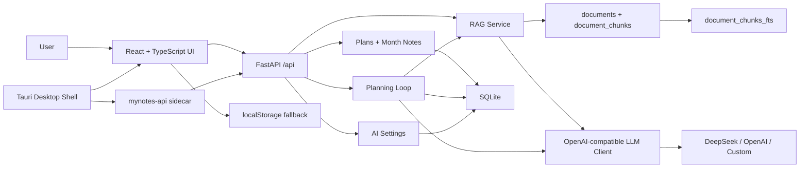

<p align="center">
  <br>
  <strong>MyNotes AI</strong>
  <br>
  <span>AI learning planner, daily review, local RAG, and desktop-ready knowledge assistant.</span>
  <br><br>
  
  
  
  
</p>


## 涓枃浠嬬粛

**MyNotes AI** 鏄竴涓潰鍚戝涔犮€佹眰鑱屽拰闀挎湡鐩爣绠＄悊鐨?AI 瑙勫垝绯荤粺銆傚畠涓嶆槸绠€鍗曠殑鏃ュ巻鎴栬亰澶╂锛岃€屾槸鎶娾€滅洰鏍囪緭鍏ャ€佽祫鏂欐矇娣€銆丄I 瑙勫垝銆佹棩绋嬫墽琛屻€佹棩鎶ュ鐩樸€侀噸鎺掗瑙堛€佽祫鏂欓棶绛斺€濊繛鎴愪竴涓畬鏁撮棴鐜€?
褰撳墠鐗堟湰宸茬粡鍗囩骇鍒板己浣滃搧闆嗘柟鍚戯細鍓嶇浣跨敤 React + TypeScript + Vite锛屽悗绔娇鐢?FastAPI锛屾暟鎹眰浣跨敤 SQLite锛孉I 鑳藉姏鏀寔 DeepSeek / OpenAI-compatible 璋冪敤锛屽苟淇濈暀绋冲畾 mock fallback锛屾墍浠ユ病鏈?API key 涔熻兘瀹屾暣婕旂ず銆傞」鐩敮鎸佺矘璐磋祫鏂欍€乀XT/MD 鏂囦欢涓婁紶銆丼QLite FTS5 鍏ㄦ枃绱㈠紩銆丅M25 妫€绱€佸紩鐢ㄦ潵婧愬睍绀恒€佺洰鏍囪鍒?grounding銆佸叚缁磋鍒掕川閲忚瘎娴嬶紝浠ュ強 Tauri + FastAPI sidecar 妗岄潰鍖栭鏋躲€?
## English

**MyNotes AI** is an AI planning and review system for learning, job search, and long-term goal management. It connects goal planning, knowledge grounding, calendar execution, daily review, replan preview, material Q&A, and local evaluation into one portfolio-ready AI application.

The project uses React + TypeScript + Vite on the frontend, FastAPI on the backend, and SQLite as the local data layer. It supports DeepSeek/OpenAI-compatible LLM calls with deterministic mock fallback, so the full workflow remains demoable without an API key. It also prepares a Tauri desktop shell that can later bundle the web app and a FastAPI sidecar.

## Current Stage

| Stage | Status | Result |
| --- | --- | --- |
| Phase 0 | Done | Project audit in `docs/audit.md` |
| Phase 1 | Done | React + TypeScript + Vite frontend in `apps/web` |
| Phase 2 | Done | FastAPI routers, SQLite schema, plans API, month-notes API, tests |
| Phase 3 | Done | AI settings, DeepSeek-first OpenAI-compatible client, model test endpoint |
| Phase 4 | Done | Persistent goal planning, daily reviews, replan preview, apply-to-calendar flow |
| Phase 5 | Done | SQLite FTS5/BM25 RAG, document library, source citations |
| Phase 6 | Done | TXT/MD upload RAG and six-dimension planner evaluation |
| Phase 7 | Done | Tauri desktop shell, FastAPI sidecar packaging entry, build scripts, desktop CI check |
| Phase 8 | Done | Windows installer scripts, sidecar packaging checks, GitHub Release automation |
| Phase 9 | Next | Desktop polish, auto-update, code signing, and portfolio presentation upgrades |

## Features

| Module | What it does |
| --- | --- |
| Calendar planning | Manage daily tasks with time, status, completion notes, AI/manual source |
| Daily review loop | Generate persisted daily reviews and preview tomorrow's replanning |
| Replan apply | AI suggestions never mutate data until the user confirms |
| Knowledge base | Save pasted JD, notes, interview materials, or project context |
| File RAG upload | Upload `.txt` and `.md` materials into the same FTS5 knowledge base |
| FTS5/BM25 RAG | Chunk local materials, search with SQLite FTS5, rank with BM25 |
| Source citations | Return document title, chunk, score, and chunk index for every answer |
| Goal grounding | Goal planning can retrieve relevant knowledge-base chunks before generation |
| Model settings | Configure provider, base URL, model, API key, temperature, and timeout |
| Mock fallback | All AI workflows remain demoable without a paid API key |
| Evaluation | Score planning quality across six fixed dimensions |
| Desktop scaffold | Prepare Tauri window, sidecar backend strategy, packaging scripts, and CI checks |

## Tech Stack

| Layer | Stack |
| --- | --- |
| Frontend | React 18, TypeScript, Vite, lucide-react |
| Backend | Python, FastAPI, Pydantic, httpx |
| Database | SQLite, FTS5 virtual table, BM25 ranking |
| AI workflow | Planner Agent, Planning Loop, RAG, Memory, Eval, DeepSeek/OpenAI-compatible client |
| Desktop | Tauri v2 scaffold, FastAPI sidecar strategy, PyInstaller spec |
| Quality | Pytest, Vitest, ESLint, TypeScript build, GitHub Actions |

## Architecture



More details:

- [Architecture](docs/architecture.md)
- [Desktop Packaging Notes](docs/desktop.md)

## Run Locally

Start the backend:

```bash
python -m venv .venv
.\.venv\Scripts\activate
pip install -r requirements.txt
uvicorn backend.app.main:app --reload
```

Start the frontend:

```bash
cd apps/web
npm install
npm run dev
```

Open:

```text
http://127.0.0.1:5173
```

## Desktop Preparation

Phase 8 provides the Windows MSI release pipeline. Normal users only need to download the `.msi` installer, double-click it, and open `MyNotes AI` from the Windows Start menu.

Normal users do not need Node.js, Python, Rust, Cargo, npm, pip, a command line, `mynotes-api.exe`, or `$env:MYNOTES_SKIP_SIDECAR="1"`. The FastAPI backend is bundled as a Tauri sidecar and starts automatically.

Do not download `Source code.zip` as the installer. Download the MSI asset:

```text
release/MyNotes-AI-v1.1.2-windows-x64.msi
```

After installation, the app should have this shape:

```text
H:\mynotes\
  mynotes.exe
  resources\
    index.html
    assets\
    binaries\
      mynotes-api.exe
```

If the desktop app shows `asset not found: index.html`, the installer was built incorrectly or the frontend assets are missing. Download the latest MSI again and reinstall.

AI features require the user to enter their own DeepSeek API key inside the app. Calendar, planning records, local notes, local RAG materials, and basic offline mock AI behavior remain available locally without a developer environment.

For developers, a machine with Node.js, Python, PyInstaller, Rust/Cargo, and the Tauri CLI can build the installer locally, while GitHub Actions can publish release assets from a `v*` tag.

```powershell
.\scripts\check-packaging-toolchain.ps1
.\scripts\build-web.ps1
.\scripts\build-backend.ps1
cd apps\desktop
npm install
npm run build
```

Build the full release package:

```powershell
.\scripts\build-release.ps1 -Version 1.1.2
```

The expected release assets are:

```text
release/MyNotes-AI-v1.1.2-windows-x64.msi
release/MyNotes-AI-v1.1.2-windows-x64.sha256
```

The release design is:

```text
Tauri window -> index.html -> mynotes-api sidecar -> FastAPI -> SQLite user data directory
```

Desktop environment variables:

| Variable | Purpose |
| --- | --- |
| `MYNOTES_ENV=desktop` | Makes the backend resolve SQLite data under the user data directory |
| `MYNOTES_DB_PATH` | Optional database path override |
| `MYNOTES_API_PORT` | Optional API port, default `8000` |

## AI Configuration

Configure the model inside the AI workspace:

```text
Provider: DeepSeek
Base URL: https://api.deepseek.com
Model: deepseek-chat
API Key: your key
```

API keys are accepted by the backend but never returned by `GET /api/ai/settings`. Without a key, the backend returns stable mock results.

Environment variables are also supported:

```bash
AI_PROVIDER=deepseek
AI_API_KEY=
AI_API_BASE=https://api.deepseek.com
AI_MODEL=deepseek-chat
DATABASE_URL=sqlite:///./data/mynotes.db
```

## RAG Workflow

1. Paste a JD, course note, interview note, or project brief into the knowledge base, or upload a `.txt/.md` file.
2. `POST /api/rag/documents` and `POST /api/rag/documents/upload` save metadata into `documents` and chunks into `document_chunks`.
3. Each chunk is inserted into `document_chunks_fts`.
4. `POST /api/rag/query` searches with FTS5, ranks with `bm25()`, and returns `answer`, `sources`, and `keywords`.
5. `POST /api/planning/goal-plan` also retrieves matching sources and shows them as planning references.

## Verify

Backend:

```bash
python -m compileall backend
.\.venv\Scripts\python.exe -m pytest backend/tests
```

Frontend:

```bash
cd apps/web
npx.cmd tsc -b
npm.cmd run lint
npm.cmd run test
npm.cmd run build
```

Desktop scaffold:

```powershell
.\scripts\check-desktop-config.ps1
```

Packaging toolchain:

```powershell
.\scripts\check-packaging-toolchain.ps1
```

Sidecar health check:

```powershell
.\scripts\wait-api-health.ps1 -Url http://127.0.0.1:8000/api/health
```

Installed MSI smoke test for developers:

```powershell
.\scripts\smoke-test-installed.ps1
```

## API

| Endpoint | Purpose |
| --- | --- |
| `GET /api/health` | Health check |
| `GET /api/plans?date=YYYY-MM-DD` | List plans for one day |
| `POST /api/plans` | Create a plan |
| `PATCH /api/plans/{id}` | Update a plan |
| `DELETE /api/plans/{id}` | Delete a plan |
| `GET /api/month-notes?year=YYYY&month=M` | Read a monthly note |
| `PUT /api/month-notes` | Save a monthly note |
| `GET /api/ai/settings` | Read public model settings without exposing the key |
| `PUT /api/ai/settings` | Save provider, model, base URL, key, temperature, and timeout |
| `POST /api/ai/test` | Test the configured model or mock fallback |
| `POST /api/planning/goal-plan` | Generate and persist a goal plan with optional RAG sources |
| `POST /api/planning/daily-review` | Generate and persist a daily review plus replan preview |
| `GET /api/planning/daily-review?date=YYYY-MM-DD` | Read a saved daily review |
| `POST /api/planning/replan/apply` | Apply preview tasks to the calendar |
| `POST /api/rag/documents` | Save pasted material and build FTS chunks |
| `POST /api/rag/documents/upload` | Upload a TXT/MD file and build FTS chunks |
| `GET /api/rag/documents` | List knowledge-base documents |
| `DELETE /api/rag/documents/{id}` | Delete a document and its chunks |
| `POST /api/rag/ingest` | Legacy ingest endpoint, still supported |
| `POST /api/rag/query` | Query the local knowledge base and return citations |
| `POST /api/agent/plan` | Generate staged planning output |
| `POST /api/agent/review` | Generate daily review suggestions |
| `POST /api/memory/preferences` | Save preferences |
| `POST /api/eval/planner` | Evaluate planner quality across six dimensions |

## Resume Pitch

鐙珛寮€鍙?**MyNotes AI** 瀛︿範瑙勫垝绯荤粺锛屽熀浜?React + TypeScript + Vite 鏋勫缓鍓嶇锛屼娇鐢?FastAPI + SQLite 瀹炵幇鏈湴鏁版嵁灞傦紝鏀寔鏃ョ▼绠＄悊銆佺洰鏍囨媶瑙ｃ€佹棩鎶ュ鐩樸€侀噸鎺掗瑙堛€佽祫鏂欏簱闂瓟銆佹枃浠朵笂浼犮€佸亸濂借蹇嗐€佹ā鍨嬮厤缃拰瑙勫垝璐ㄩ噺璇勪及锛涘疄鐜?DeepSeek-first 鐨?OpenAI-compatible LLM client锛屽苟淇濈暀 mock fallback锛屼繚璇佹棤 API key 鏃朵篃鍙畬鏁存紨绀猴紱鍩轰簬 SQLite FTS5/BM25 鏋勫缓鏈湴 RAG 妫€绱㈣兘鍔涳紝瀵圭矘璐磋祫鏂欏拰 TXT/MD 鏂囦欢杩涜鍒囩墖銆佺储寮曘€乀op-K 鍙洖鍜屽紩鐢ㄦ潵婧愬睍绀猴紝骞跺皢妫€绱㈢粨鏋滄帴鍏ョ洰鏍囪鍒掓祦绋嬶紱琛ラ綈 Tauri 妗岄潰澹炽€丗astAPI sidecar 鎵撳寘鍏ュ彛銆佹瀯寤鸿剼鏈拰 CI 闈欐€佹鏌ワ紝涓哄悗缁?Windows 瀹夎鍖呭彂甯冨仛鍑嗗銆?
## License

MIT

