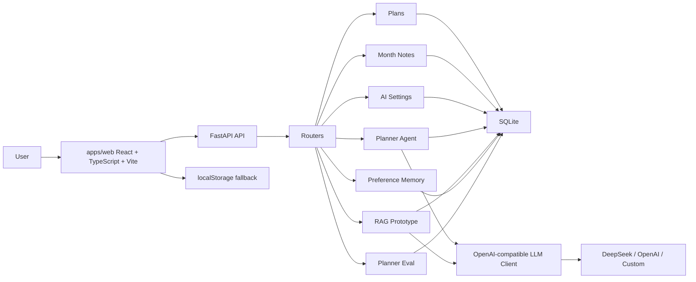

# MyNotes AI Architecture



## Data Flow

The frontend is API-first for plans, month notes, and AI settings. When the backend is available, data is stored in SQLite through FastAPI. When the backend or AI provider is unavailable, the UI still works through localStorage and mock fallback.

## LLM Flow

1. The user saves provider, base URL, model, API key, temperature, and timeout in the AI workspace.
2. `GET /api/ai/settings` returns only public settings and `hasApiKey`.
3. `LlmClient` reads the latest settings for each request.
4. If provider is `mock` or no key is available, AI features return deterministic mock output.
5. If a key exists, `LlmClient` calls an OpenAI-compatible `/v1/chat/completions` endpoint.
6. Success and failure records are written to `ai_runs`.

## Backend Layout

```text
backend/app/
  main.py
  db.py
  desktop_paths.py
  schemas.py
  routers/
    health.py
    plans.py
    month_notes.py
    settings.py
    agent.py
    rag.py
    preferences.py
  services/
    ai_settings.py
    llm.py
    plans.py
    month_notes.py
    planner.py
    rag.py
    memory.py
    evaluator.py
    tools.py
```

## SQLite Tables

| Table | Purpose |
| --- | --- |
| `plans` | Daily task records |
| `month_notes` | Monthly notes |
| `daily_reviews` | AI review output planned for later phases |
| `ai_settings` | Provider, model, key state, temperature, and timeout |
| `user_preferences` | Preference memory |
| `documents` | Uploaded or pasted material metadata |
| `document_chunks` | Retrieval chunks |
| `ai_runs` | AI call logs, mock fallback records, and error records |

## Interview Talking Points

- The app moved from localStorage-only storage to an API-first SQLite data layer.
- AI provider settings are persisted locally but API keys are not returned to the browser after save.
- The LLM client is OpenAI-compatible, so DeepSeek, OpenAI, or a custom compatible endpoint can be swapped.
- Planner and RAG services read the latest model settings on each request.
- Mock fallback keeps the project demoable without paid credentials.
