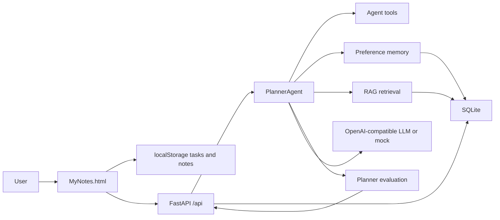

# MyNotes AI Architecture

## Modules

- Frontend: plain HTML, CSS and JavaScript, no build step.
- Backend: FastAPI API service.
- Agent: goal planning, review generation and tool-call style outputs.
- RAG: lightweight chunking and keyword retrieval over pasted materials.
- Memory: user preference storage for planning rhythm.
- Evaluation: simple test-case scoring for planner quality.
- Storage: browser localStorage for user tasks, SQLite for backend AI events, memory and RAG chunks.

## Demo Modes

- File preview: `MyNotes.html` uses Mock AI by default.
- Backend mode: enable API calls with `my_notes_api_enabled=1`.
- LLM mode: set `.env` values for an OpenAI-compatible provider.
