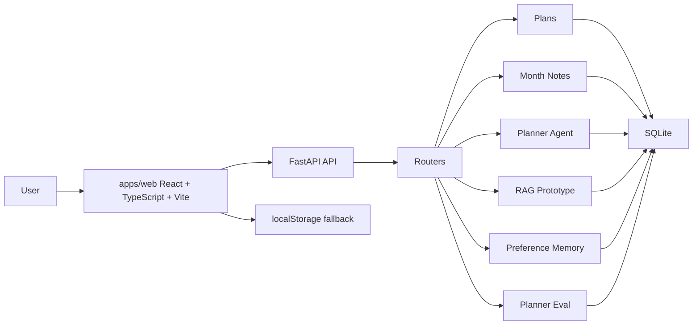

# MyNotes AI Architecture



## Data Flow

The frontend is API-first for plans and month notes. When the backend is available, new data is stored in SQLite through FastAPI. When the backend is unavailable, the UI still works with localStorage so the app remains demoable from the frontend alone.

## Backend Layout

```text
backend/app/
  main.py
  db.py
  desktop_paths.py
  schemas.py
  routers/
    health.py
    plans.py
    month_notes.py
    agent.py
    rag.py
    preferences.py
  services/
    plans.py
    month_notes.py
    planner.py
    rag.py
    memory.py
    evaluator.py
    tools.py
```

## SQLite Tables

| Table | Purpose |
| --- | --- |
| `plans` | Daily task records |
| `month_notes` | Monthly notes |
| `daily_reviews` | AI review output planned for later phases |
| `ai_settings` | Provider/model settings planned for DeepSeek integration |
| `user_preferences` | Preference memory |
| `documents` | Uploaded or pasted material metadata |
| `document_chunks` | Retrieval chunks |
| `ai_runs` | AI run logs and demo events |

## Interview Talking Points

- The project moved from localStorage-only storage to an API-first SQLite data layer.
- The frontend keeps a graceful local fallback, so demos do not fail when the backend is offline.
- FastAPI routers separate public API shape from service-level business logic.
- The SQLite schema already reserves space for reviews, provider settings, document chunks, and AI run logs.
- The next phase can plug a DeepSeek-compatible client into the existing Agent/RAG/Memory flow.
